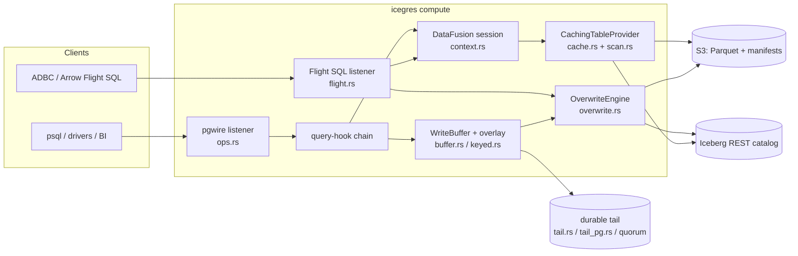
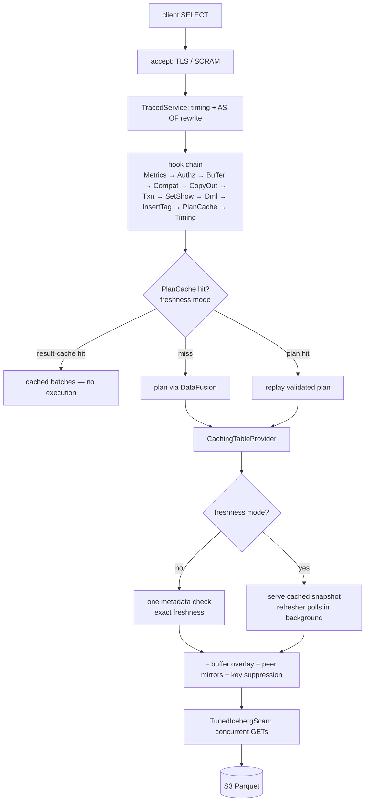
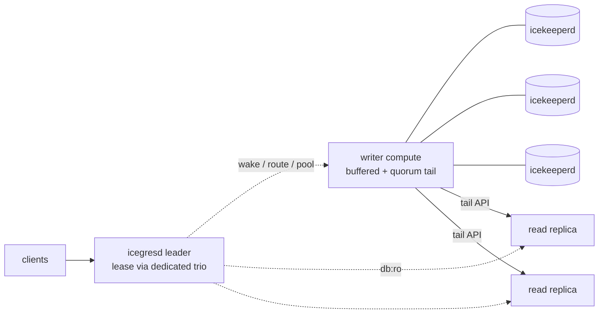

# Architecture

How icegres is put together: the components, the read path, the write paths,
the commit protocol, the durability ladder, and the HA topology. This is the
overview; the **module-level rustdoc headers are the authoritative deep
documentation** — every section below names its modules, and
`icegres/src/<module>.rs` carries the full design notes, invariants, and honest
caveats for that piece.

Companion docs: [`configuration.md`](configuration.md) (every knob),
[`cqrs-topology.md`](cqrs-topology.md) (which tier serves which workload, with
measured latencies), [`limitations.md`](limitations.md) (deliberate
non-goals), [`deployment.md`](deployment.md) (operations),
[`open-tail-protocol.md`](open-tail-protocol.md) (tail wire spec).

## The big picture

icegres is a Rust server that mounts Apache Iceberg tables from any REST
catalog and serves them read-write over **two wire protocols** — the Postgres
wire protocol (`icegres serve`, via datafusion-postgres) and Arrow Flight SQL
(`icegres flight-serve`) — with DataFusion as the query engine and
iceberg-rust for table IO. There is **one copy of the data** (Parquet in
S3-compatible object storage); everything else is protocol surface, caching,
and durability machinery around it.

## Components

**Serving layer**
- `ops.rs` — the operational shell of `icegres serve`: accept loop, TLS
  (fail-closed at boot), SCRAM-SHA-256 (`--auth-file`), scale-to-zero
  (`--idle-shutdown-secs`), the `--health-port` liveness/metrics endpoint, and
  `COPY … TO STDOUT`.
- `flight.rs` — the second first-class protocol: queries, catalog metadata,
  prepared statements, DML, and bulk ingest (`adbc_ingest` → one fast-append
  commit), sharing the exact same session, providers, and engine as pgwire.
- `traced.rs` / `metrics.rs` — per-query timing spans, slow-query WARNs, and
  the Prometheus counters served on `/metrics`.
- `compat.rs` — pg_catalog/ORM shims so SQLAlchemy, JDBC, ODBC, and BI tools
  introspect icegres like a stock Postgres.

**Query engine layer**
- `context.rs` — builds the shared DataFusion session: REST-catalog
  connection, S3 wiring, and the bounded memory pool (FairSpillPool + disk
  spill — heavy queries spill, then error; never OOM).
- `cache.rs` — `CachingTableProvider`: exact freshness by default (one cheap
  metadata check per scan), snapshot-pinned time travel (`table@snapshot_id`),
  and the stale-serve-on-catalog-error policy.
- `scan.rs` — `TunedIcebergScan`: IO-tuned Iceberg scans (concurrent object
  GETs, right-sized batches) that also feed each snapshot's live row count to
  the optimizer so hash joins pick the smaller build side.
- `freshness.rs` / `plancache.rs` — opt-in bounded-staleness mode: a
  background refresher replaces the per-scan catalog check, which also enables
  the physical-plan cache and the opt-in result cache (both invalidated by
  table metadata version).

**Write layer**
- `overwrite.rs` — `OverwriteEngine`: hand-rolled copy-on-write commits
  (iceberg-rust 0.10.0 has no overwrite action), optimistic concurrency, and
  PK enforcement. All writes bound to: format v2, unpartitioned, Parquet,
  no delete manifests.
- `dml.rs` / `txn.rs` — UPDATE/DELETE interception and the
  BEGIN/COMMIT/ROLLBACK model (per-table snapshot pinning; commit-time
  conflicts are `40001`, never silent).
- `buffer.rs` / `keyed.rs` — opt-in buffered writes (`--write-buffer-ms`):
  ack-from-memory INSERTs, group commits, union-read overlays, and keyed
  hot-row upserts.

**Durability & fleet layer**
- `tail.rs` / `tail_pg.rs` / `quorum/` — the three durable-tail backends
  (local WAL, Postgres, 3-acceptor consensus) that close the buffered-write
  loss window; exactly-once replay via a watermark committed atomically with
  the data.
- `tailapi.rs` / `peer.rs` — the open tail read API (Arrow Flight) and fleet
  overlays: peer computes mirror a writer's un-flushed tail into their scans.
- `branch.rs` / `asof.rs` — zero-copy branches (snapshot refs) and
  `AS OF` time-travel sugar.
- `compact.rs` / `maintain.rs` / `verify.rs` — bin-pack compaction, snapshot
  expiry, orphan GC, and the self-service durability prover.

**Daemons**
- `bin/icegresd.rs` — pgwire-aware control plane: wake-on-connect, branch
  routing, session pooling, crash supervision, consensus-fenced tail-writer
  failover, leader-lease redundancy, read replicas, Kubernetes mode.
- `bin/icekeeperd.rs` — the quorum acceptor: fsync-before-ack,
  vote-persist-before-cast; three of them form the consensus tail (algorithm
  adapted from Neon's SafeKeeper — see NOTICE).

## The read path

Key properties: the default mode is **exactly fresh** (every scan verifies the
current snapshot); `--freshness-ms N` trades that for latency with a bounded
staleness window; the local server's **own writes are always exact** (buffer
overlays are unioned per scan and never cached; local writes invalidate
synchronously). The hook chain order is load-bearing and documented in
`main.rs` — e.g. the buffer's ordering fences must run before any statement
they fence.

Flight reads follow the same engine path (`GetFlightInfo` → `DoGet` streaming
Arrow IPC) with per-RPC authorization and no SQL-sugar rewrites.

## The write paths

Four ways in, one commit protocol out:

| Path | Trigger | Latency class | Durability at ack |
|---|---|---|---|
| Synchronous COW | UPDATE/DELETE, plain INSERT | ~50 ms (catalog commit) | Iceberg snapshot |
| Buffered INSERT | `--write-buffer-ms N` | ~1.3–4.1 ms (by tail backend) | in-memory + tail frame (if configured) |
| Keyed upsert | PK tables + `icegres.tail-upsert` | ~5 ms | tail frame, coalesced per key |
| Flight bulk ingest | `adbc_ingest` | one commit per stream | Iceberg snapshot |

```mermaid
flowchart TD
    subgraph sync [Synchronous COW - overwrite.rs]
        S1[load table → anchor snapshot] --> S2[read live files, fold DML ops]
        S2 --> S3[classify kept / removed / rewritten]
        S3 --> S4[write Parquet survivors + appends]
        S4 --> S5[manifests: ADDED / EXISTING / DELETED]
        S5 --> S6[REST commit<br/>assert-table-uuid + assert-ref-snapshot-id]
        S6 -- 409 --> S7{autocommit?}
        S7 -- yes, ≤3 --> S1
        S7 -- txn --> S8[40001 to client]
    end
    subgraph buf [Buffered - buffer.rs]
        B1[INSERT] --> B2[append to in-memory buffer]
        B2 --> B3[fsync ONE tail frame]
        B3 --> B4[ack ~ms]
        B5[flusher: every N ms or row cap] --> B6[one snapshot per table<br/>+ tail-seq watermark, same commit]
        B6 --> B7[truncate tail]
    end
```

**PK enforcement** happens inside the commit: the final row set's key columns
are validated (NULL → `23502`, duplicate → `23505`) against the very snapshot
the commit anchors to, and a 409 retry re-validates against fresh metadata —
racing INSERTs of the same key cannot both land.

**Transactions** (`txn.rs`): BEGIN pins each table's snapshot at first touch
(REPEATABLE READ analogue); writes buffer in the session; COMMIT produces one
snapshot per table anchored at the pin with **no retry** — a moved head is a
clean `40001`. Multi-table COMMITs are atomic via the REST transactions
endpoint where the catalog supports it (Lakekeeper does); otherwise ordered
per-table commits, with `ICEGRES_TXN_STRICT` available to refuse the
non-atomic fallback up front.

## The durability ladder

Each rung changes only *what survives*; the ack path and replay rules are
shared (`buffer.rs` + the tail backends).

| Rung | Acked writes survive | Blocking behavior |
|---|---|---|
| buffer only | nothing beyond process life (≤ N ms loss on unclean kill; WARN on enable) | never blocks |
| `--tail-dir` | process kill (fsync'd local WAL; flock one-writer guard) | disk errors surface |
| `--tail-url` | compute-node loss (frames in Postgres; its replication = the durability class) | unreachable tail DB blocks buffered writes — errors, never silent loss |
| `--tail-quorum` | any single node incl. the compute (2-of-3 acceptor fsyncs before ack) | <2 live acceptors blocks; quorum loss poisons the tail |

**Exactly-once replay:** every flush commit stamps the
`icegres.tail-seq.<tail-id>` table property in the *same atomic commit* as the
rows; boot replay drops frames at or below the watermark. **Fencing:** flock
(dir), advisory lock + watermark CAS (url), consensus terms (quorum — a
higher-term writer makes the old one's appends fail and its tail self-poison:
"superseded by a newer server").

## HA topology

- **Writer failover** (quorum tails): a wedged or fenced writer answers 503 on
  `/health`; icegresd (or the kubelet, in the Helm chart) kills and replaces
  it; the replacement's quorum election fences the old term and **replays the
  acked window before serving** (measured p50 ≈ 93 ms process-mode).
- **icegresd redundancy**: N instances, one leader via a *dedicated*
  icekeeperd lease trio (never shared with the data trio); standbys answer
  retryable `57P03`.
- **Read replicas** are stateless, spawned with tail env deliberately stripped
  (a replica opening the writer's tail would fence it), and follow the writer
  via `--peer-tail` (fresh un-flushed rows) + `--freshness-ms` (committed
  data). A silent peer degrades to commit-cadence freshness with a WARN —
  rows are never lost, only the freshness bonus.

The Kubernetes shape of all of this is the Helm chart
([`deploy/helm/icegres/`](../deploy/helm/icegres/README.md)) with the runbook
in [`deployment.md`](deployment.md) §11.

## Where to go deeper

| Question | Module docs to read |
|---|---|
| Why is the hook order what it is? | `main.rs` (`query_hooks` rustdoc) |
| Exact buffer flush/race protocol | `buffer.rs` |
| Tail frame format, torn writes, group fsync | `tail.rs` |
| Consensus election / donor recovery / fencing | `quorum/proposer.rs`, `tail_quorum.rs` |
| COW manifest/snapshot assembly | `overwrite.rs` |
| Transaction pin/commit semantics | `txn.rs` |
| Freshness generations & the write/refresh race | `freshness.rs` |
| Plan/result cache soundness envelope | `plancache.rs` |
| Compaction safety rails | `compact.rs` |
